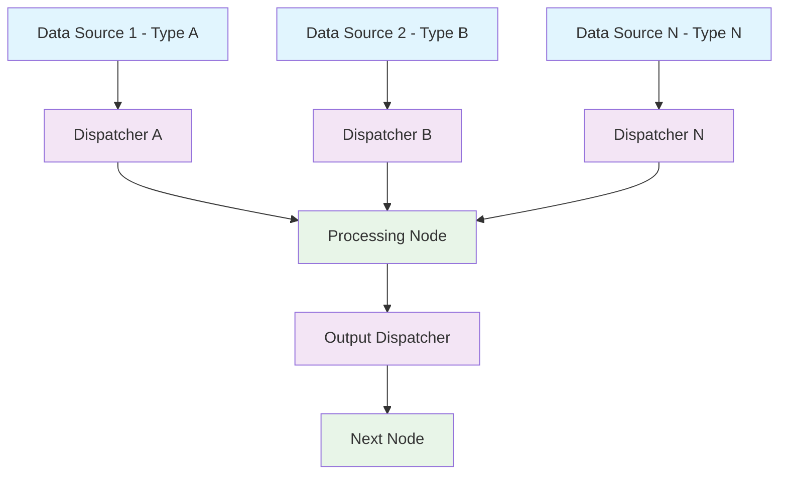

# Conduit - Reactive Dispatcher Framework

Conduit is a high-performance, low-latency reactive framework designed for building event-driven data processing pipelines. The framework enables the creation of nodes that can subscribe to multiple dispatchers with different data types, allowing for complex data flow processing with heterogeneous inputs.

## Overview

Conduit provides a flexible and type-safe approach to reactive programming where:

- **Dispatchers** emit data to subscribed nodes
- **Nodes** can accept multiple inputs of different types and process them accordingly
- **Event-driven architecture** ensures data flows through the system in response to events
- **High performance** is achieved through the use of the LMAX Disruptor pattern for zero-copy, lock-free operations

## Features

- **Low-latency processing** using the LMAX Disruptor ring buffer
- **Multi-type input support** - nodes can process different data types simultaneously
- **Fluent API** for easy pipeline construction
- **Thread-safe** event dispatching with Disruptor pattern
- **Type safety** through generic interfaces
- **Flexible node composition** up to 9 different input types
- **Heterogeneous data processing** with automatic type detection

## Architecture

The framework consists of two core concepts:

1. **Dispatcher** - An interface responsible for dispatching data to subscribers
2. **Node** - Components that subscribe to dispatchers and process data with different callbacks based on source dispatcher and data type

The design supports nodes with up to 9 different input types, each with its own callback method:

- `Node1`, `Node2`, ..., `Node9` - for nodes with 1 to 9 different input types
- `DisruptorNode1`, `DisruptorNode2`, ..., `DisruptorNode9` - Disruptor-based implementations for high-performance scenarios

## Getting Started

### Example: Basic Usage

```java
import io.lightning.conduit.dispatcher.EventDispatcher;
import io.lightning.conduit.node.DisruptorNode2;

// Create dispatchers for different data types
EventDispatcher<Integer> intDispatcher = EventDispatcher.create();
EventDispatcher<String> stringDispatcher = EventDispatcher.create();

// Create a node that handles two different input types
public static class CombineNode extends DisruptorNode2<Integer, String> {
    @Override
    public void onEvent1(Integer event) {
        System.out.println("Received integer: " + event);
    }

    @Override
    public void onEvent2(String event) {
        System.out.println("Received string: " + event);
    }
}

// Initialize and connect components
CombineNode combineNode = new CombineNode();
combineNode.subscribe1(intDispatcher);
combineNode.subscribe2(stringDispatcher);
combineNode.start();

// Dispatch data
intDispatcher.dispatch(42);
stringDispatcher.dispatch("Hello, Conduit!");
```

### Example: Complex Pipeline

```java
// Create multiple dispatchers for different data types
EventDispatcher<Price> priceDispatcher = EventDispatcher.create();
EventDispatcher<Rate> rateDispatcher = EventDispatcher.create();
EventDispatcher<Volume> volumeDispatcher = EventDispatcher.create();

// Create a node that processes three different input types
public static class FinancialProcessor extends DisruptorNode3<Price, Rate, Volume> {
    @Override
    public void onEvent1(Price price) {
        // Process price data
    }

    @Override
    public void onEvent2(Rate rate) {
        // Process rate data
    }

    @Override
    public void onEvent3(Volume volume) {
        // Process volume data
    }
}

// Create and configure the processor
FinancialProcessor processor = new FinancialProcessor();
processor.subscribe1(priceDispatcher)
         .subscribe2(rateDispatcher)
         .subscribe3(volumeDispatcher);
processor.start();

// Dispatch data to trigger processing
priceDispatcher.dispatch(new Price(100.0));
rateDispatcher.dispatch(new Rate(0.05));
volumeDispatcher.dispatch(new Volume(1000));
```

## Key Components

### Dispatcher Interface

The `EventDispatcher` provides:
- `dispatch(T event)` - Dispatch an event to all listeners
- `register(Listener<T> listener)` - Register a new event listener
- `unregister(Listener<T> listener)` - Remove a previously registered listener
- `clear()` - Clear all registered listeners

### Node Interface

Nodes implement:
- `start()` - Initialize and start the node
- `subscribe1()`, `subscribe2()`, ..., `subscribe9()` - Subscribe to different dispatchers
- `onEvent1()`, `onEvent2()`, ..., `onEvent9()` - Callback methods for each input type

### Disruptor Integration

The framework leverages the LMAX Disruptor for high-performance scenarios:
- `DisruptorComponent` manages the ring buffer and event processing
- `BusySpinWaitStrategy` for ultra-low latency
- Configurable buffer sizes for performance tuning
- Support for multi-producer scenarios

## Performance

Conduit achieves high performance through:

- **LMAX Disruptor** for lock-free event processing
- **Ring buffer** for zero-copy operations
- **Single-threaded execution** to minimize synchronization overhead
- **Object pooling** to reduce garbage collection pressure
- **Cache-friendly data structures** for optimal memory access patterns

## Dependencies

- Java 21+
- LMAX Disruptor 4.0.0
- SLF4J for logging
- Logback for logging implementation
- Lombok for reduced boilerplate code

## Building and Running

### Prerequisites

- Java 21 or higher
- Maven 3.6.0 or higher

### Build

```bash
mvn clean install
```

## Use Cases

Conduit is ideal for:

- **Financial systems** - Processing market data feeds with different instruments
- **Real-time analytics** - Aggregating multiple data streams
- **IoT applications** - Handling sensor data from multiple sources
- **Event-driven architectures** - Building reactive microservices

## License

This project is licensed under the MIT License - see the [LICENSE](LICENSE) file for details.

## Architecture Diagram

